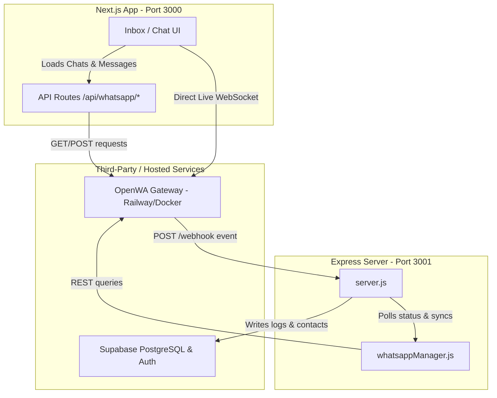

<!-- BEGIN:nextjs-agent-rules -->
# This is NOT the Next.js you know

This version has breaking changes — APIs, conventions, and file structure may all differ from your training data. Read the relevant guide in `node_modules/next/dist/docs/` before writing any code. Heed deprecation notices.
<!-- END:nextjs-agent-rules -->

<!-- BEGIN:git-rules -->
# Git Workflow Rule
For every big file update, commit the changes. At the end of an implementation plan, push the changes to GitHub.
<!-- END:git-rules -->

# UniCrew Project Context for AI Agents

UniCrew is a CRM platform designed for educational institutions to manage communications between student prospects and student ambassadors, integrating directly with WhatsApp via an OpenWA gateway.

## 🏗️ System Architecture



### 1. Frontend (Next.js)
* **Location:** `/frontend`
* **Technologies:** Next.js (App Router), React, Tailwind CSS.
* **Communication:**
  * Uses `/api/whatsapp` proxy endpoints to communicate with the OpenWA REST API.
  * Connects to Socket.IO at `${OPENWA_API_URL}/events` to listen for live `message.received` events in the browser.

### 2. Backend (Express.js)
* **Location:** `/backend`
* **Technologies:** Express, `@supabase/supabase-js`, `whatsappManager.js`.
* **Endpoints:**
  * `POST /webhook`: Listens to incoming webhook payloads from OpenWA. Parses the message body, upserts the contact, and logs the interaction into Supabase.
  * `POST /api/whatsapp/sync`: Triggered manually to poll the most recent chats and messages directly from OpenWA and insert them into Supabase.

### 3. WhatsApp Gateway (OpenWA)
* **Host:** Deployed on Railway (`https://openwa-production-7315.up.railway.app`) or run locally via `docker-compose` on port `2785`.
* **Engine Type:** `baileys` (lightweight WhatsApp API client).

---

## 🗄️ Database Schema & Row Level Security

The backend uses a Supabase database instance bypassing RLS rules with the Service Role Key. Key tables in `/backend/supabase-schema.sql` include:

* **`contacts`**: Stores prospects' phone numbers, names, channels (e.g. `WhatsApp`), and intent.
* **`interaction_logs`**: Stores actual chat messages exchanged, linked to a contact.
* **`internal_users` & `teams`**: Handles platform ambassador hierarchy.
* **`kanban_cards` & `kanban_stages`**: Drives the visual student pipelines.

---

## 🛠️ Key Integration Configurations

### 1. Webhook Delivery Flow
For incoming WhatsApp messages to appear in the dashboard and database:
1. OpenWA receives the message from WhatsApp.
2. OpenWA fires an HTTP POST request to the registered webhook (e.g., `https://<backend-domain>/webhook`).
3. The Express backend receives the payload, creates/updates the contact in `contacts`, and inserts a record in `interaction_logs`.

> [!WARNING]
> **Webhook Wipes:** OpenWA stores webhooks per-session. If a session is restarted, deleted, or recreated (generating a new session ID), all previously registered webhooks are wiped. They must be registered again via a `POST /api/sessions/:sessionId/webhooks` payload.

### 2. Development Setup (Exposing Backend)
Since the OpenWA instance runs in a remote cloud environment (Railway) and your Express server runs locally on port `3001`:
* You must expose `localhost:3001` to the internet using a tunneling tool (like `ngrok` or `localtunnel`).
* Set your webhook URL in OpenWA to the generated public URL (e.g. `https://xxxx.ngrok-free.app/webhook`).

---

## 🔧 Operational & Debugging Recipes

### 1. Inspecting / Registering Webhooks
Use the utility script `/backend/manage_webhook.js` (or in the workspace scratch files) to manage webhooks:
* **List Webhooks:** `node <path-to-script>/manage_webhook.js list`
* **Register Webhook:** `node <path-to-script>/manage_webhook.js register <public-url>/webhook`

### 2. Supabase DB Permission Issues
If the backend throws `permission denied for table contacts` or `interaction_logs`, run these SQL commands in the Supabase SQL editor to restore grants:
```sql
GRANT ALL ON ALL TABLES IN SCHEMA public TO service_role;
GRANT ALL ON ALL SEQUENCES IN SCHEMA public TO service_role;
GRANT ALL ON ALL ROUTINES IN SCHEMA public TO service_role;
```
